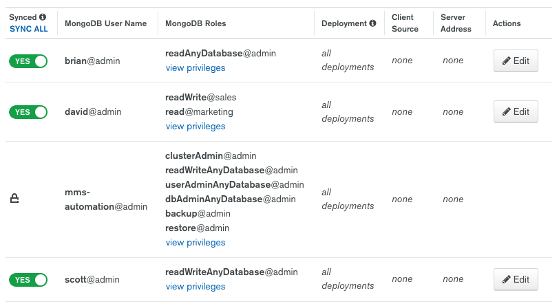
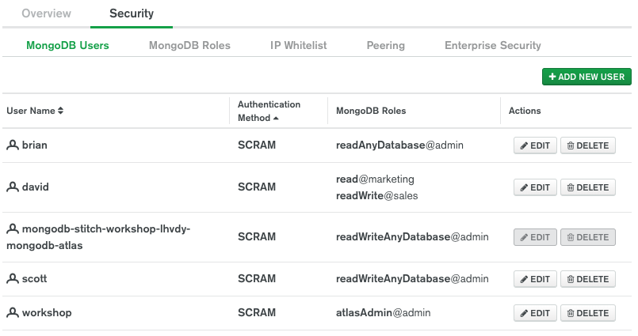

# Atlas Database User Migration Utility

Atlas provides excellent tools, such as [Live Migration](https://docs.atlas.mongodb.com/import/live-import/) and [mongomirror](https://docs.atlas.mongodb.com/import/mongomirror/) for migrating your data to Atlas. However, neither of these tools import user and role data.

This utility is a Python script that was written to assist migrating your existing database users and roles to Atlas. The only thing it can't migrate is user passwords, so the script would have to be modified with the passwords you want to use, or they would have to be changed later.

The script uses the [Python driver](https://docs.mongodb.com/ecosystem/drivers/python/#python-driver) to fetch your existing users and roles. However, as the [createUser](https://docs.mongodb.com/manual/reference/command/createUser/#dbcmd.createUser) command is [not supported](https://docs.atlas.mongodb.com/reference/unsupported-commands-paid-tier-clusters/) by Atlas, users need to be created using the [Database Users](https://docs.atlas.mongodb.com/reference/api/database-users/) REST api.

To use the tool, you need to populate a [params.py](params.py) file with your credentials. As a prerequisite, you must have already [Configured Atlas API Access](https://docs.atlas.mongodb.com/configure-api-access/). 

```
# Input parameters

# Source DB
source_conn_string = <Application connection string>
source_database = 'admin'

# For Atlas REST API
target_project_id = '<Project ID found under Atlas Project Settings>'
target_api_user = '<User Name>'
target_api_key = '<API Key>'
```
Given this existing set of users:


When run the script will display the following:

```
brianleonard$ python3 migrate_users.py

Migrating MongoDB Users

4 potential users to be migrated

>>> Migrating user:
{'_id': 'admin.brian', 'user': 'brian', 'db': 'admin', 'roles': [{'role': 'readAnyDatabase', 'db': 'admin'}], 'mechanisms': ['SCRAM-SHA-1']}

Formatted roles:
[{'databaseName': 'admin', 'roleName': 'readAnyDatabase'}]

User data sent to Atlas API:
{'databaseName': 'admin', 'roles': [{'databaseName': 'admin', 'roleName': 'readAnyDatabase'}], 'username': 'brian', 'password': 'changeme123'}

User brian created.
>>>

>>> Migrating user:
{'_id': 'admin.david', 'user': 'david', 'db': 'admin', 'roles': [{'role': 'read', 'db': 'marketing'}, {'role': 'readWrite', 'db': 'sales'}], 'mechanisms': ['SCRAM-SHA-1']}

Formatted roles:
[{'databaseName': 'marketing', 'roleName': 'read'}, {'databaseName': 'sales', 'roleName': 'readWrite'}]

User data sent to Atlas API:
{'databaseName': 'admin', 'roles': [{'databaseName': 'marketing', 'roleName': 'read'}, {'databaseName': 'sales', 'roleName': 'readWrite'}], 'username': 'david', 'password': 'changeme123'}

User david created.
>>>

<<<Skipping user mms-automation>>>

>>> Migrating user:
{'_id': 'admin.scott', 'user': 'scott', 'db': 'admin', 'roles': [{'role': 'readWriteAnyDatabase', 'db': 'admin'}], 'mechanisms': ['SCRAM-SHA-1']}

Formatted roles:
[{'databaseName': 'admin', 'roleName': 'readWriteAnyDatabase'}]

User data sent to Atlas API:
{'databaseName': 'admin', 'roles': [{'databaseName': 'admin', 'roleName': 'readWriteAnyDatabase'}], 'username': 'scott', 'password': 'changeme123'}

User scott created.
>>>
```

And you'll find the users in Atlas:



